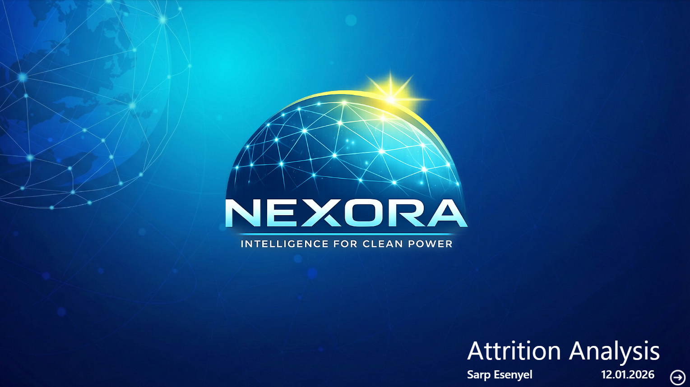
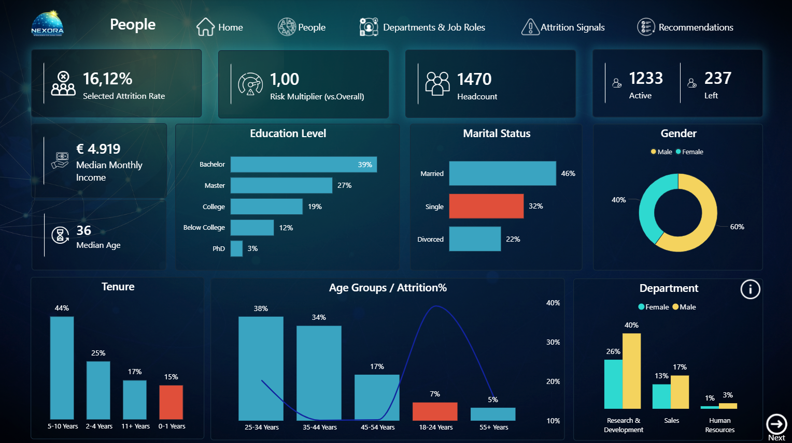
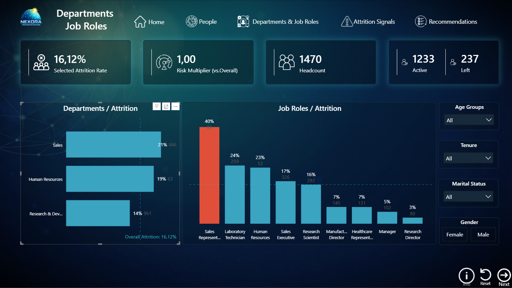
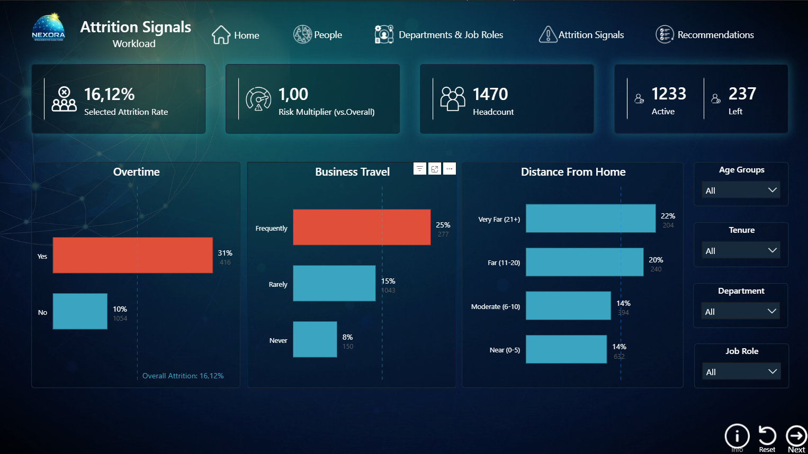
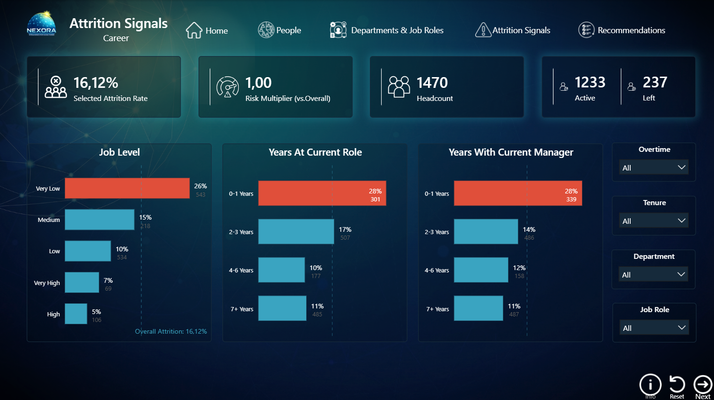
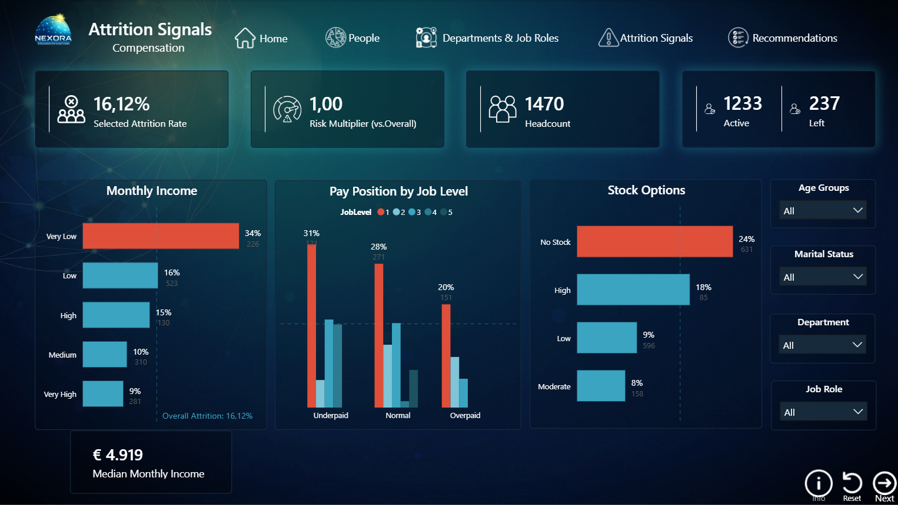
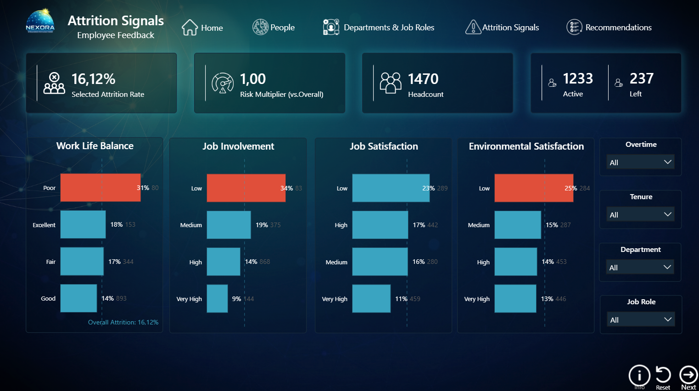
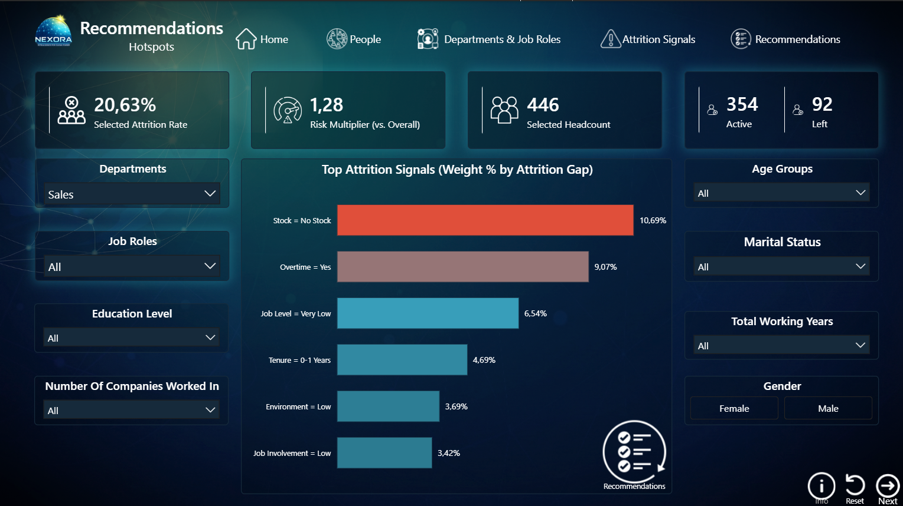
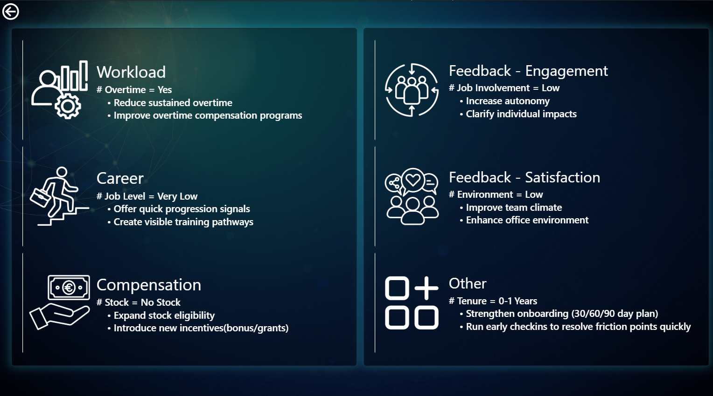

# NEXORA | HR Attrition Analysis & Recommendation Dashboard

## Overview

NEXORA is a fully interactive HR attrition analytics dashboard built in Power BI for a fictional clean energy company. The project covers workforce demographics, department and role-level attrition breakdowns, root cause investigation across six attrition signal categories, and a data-driven recommendations engine — all navigable through a custom multi-page report with dynamic filtering.

**Overall attrition rate: 16.12%** (237 employees left out of 1,470 headcount)

---

## Problem Statement

HR leadership needed to understand not just *how many* employees were leaving, but *who* was leaving, *from where*, and *why* — and what concrete actions could reduce attrition in the highest-risk segments.

---

## Dashboard Structure

The report consists of 5 main sections navigable via a top menu:

| Page | Description |
|------|-------------|
| **Home** | Cover / navigation entry point |
| **People** | Workforce demographics overview |
| **Departments & Job Roles** | Attrition breakdown by department and role |
| **Attrition Signals** | Root cause analysis across 4 sub-pages |
| **Recommendations** | Hotspot analysis + action cards |

---

## Key Metrics (Global KPIs)

- **Attrition Rate:** 16.12%
- **Headcount:** 1,470 (1,233 active / 237 left)
- **Median Monthly Income:** €4,919
- **Median Age:** 36
- **Risk Multiplier:** Dynamic DAX measure comparing selected segment vs. overall attrition

---

## People Page — Workforce Profile

- **Gender:** 60% Male / 40% Female
- **Education:** 39% Bachelor, 27% Master, 19% College
- **Tenure:** Highest attrition in 0-1 year group (44% of leavers have 5-10 years tenure; highest attrition *rate* in 0-1 years)
- **Age Groups:** Peak attrition rate in 18-24 age group; largest headcount in 25-34 and 35-44 bands
- **Departments:** Research & Development (961 headcount, 14% attrition), Sales (446, 21%), Human Resources (63, 19%)

---

## Departments & Job Roles Page

- **Highest attrition by department:** Sales at 21%
- **Highest attrition by job role:** Sales Representative at 40% — more than double the overall rate
- Other high-risk roles: Laboratory Technician (24%), Human Resources (23%), Sales Executive (17%)
- Dynamic filters: Age Groups, Tenure, Marital Status, Gender

---

## Attrition Signals — Root Cause Analysis

Four sub-pages investigate the drivers behind attrition:

### Workload
- Employees working **overtime** have a 31% attrition rate vs. 10% for those who don't — a **3x difference**
- Frequent business travel correlates with 25% attrition vs. 8% for non-travellers
- Distance from home (21+ km): 22% attrition rate

### Career
- **Very Low job level** employees: 26% attrition — highest of any level
- Employees in a role for **0-1 years**: 28% attrition
- Employees with a **new manager (0-1 years)**: 28% attrition — highlighting onboarding and management continuity as risk factors

### Compensation
- **Very Low income** band: 34% attrition rate
- Employees with **no stock options**: 24% attrition vs. 9% for those with low stock
- Pay position analysis: underpaid entry-level employees show the highest attrition concentration

### Employee Feedback
- **Poor work-life balance**: 31% attrition
- **Low job involvement**: 34% attrition
- **Low environmental satisfaction**: 25% attrition
- Low job satisfaction: 23% attrition

---

## Recommendations Page

### Hotspot Analysis
Dynamic DAX-powered ranking of top attrition signals by weighted attrition gap per selected department/role. Example (Sales dept):
- Stock = No Stock: **+10.69%** above baseline
- Overtime = Yes: **+9.07%**
- Job Level = Very Low: **+6.54%**
- Tenure = 0-1 Years: **+4.69%**

### Action Cards (6 retention strategy themes)
| Theme | Key Signal | Actions |
|-------|-----------|---------|
| Workload | Overtime = Yes | Reduce sustained overtime, improve overtime compensation |
| Career | Job Level = Very Low | Offer quick progression signals, create visible training pathways |
| Compensation | Stock = No Stock | Expand stock eligibility, introduce bonuses/grants |
| Feedback – Engagement | Job Involvement = Low | Increase autonomy, clarify individual impact |
| Feedback – Satisfaction | Environment = Low | Improve team climate, enhance office environment |
| Other | Tenure = 0-1 Years | Strengthen onboarding (30/60/90 day plan), run early check-ins |

---

## Technical Highlights

- **DAX Measures:** Dynamic attrition rate, risk multiplier (selected vs. overall), weighted attrition gap scoring for signal ranking
- **Power Query:** Data transformation and cleaning, feature categorisation (income bands, distance groups, age groups, tenure buckets)
- **Dynamic Filtering:** All pages respond to slicers (age group, tenure, department, job role, gender, marital status, overtime, etc.)
- **Custom Navigation:** Icon-based menu linking all pages with consistent KPI header across the report
- **Recommendation Engine:** DAX-driven signal ranking that re-ranks attrition drivers dynamically based on selected department and role

---

## Dashboard Preview

---

## Tools
## Download

| File | Link |
|------|------|
| `NEXORA.pbix` | [Download from Google Drive](https://drive.google.com/file/d/1b6vX7LkDs2JG58UOqbB23sn2rIvr74Ax/view?usp=sharing) |

> Power BI Desktop required to open .pbix files. [Download Power BI Desktop](https://powerbi.microsoft.com/desktop)

---

- **Power BI Desktop** — report development, DAX, Power Query
- **DAX** — KPI measures, dynamic risk multiplier, attrition gap scoring
- **Power Query (M)** — data transformation and feature engineering
